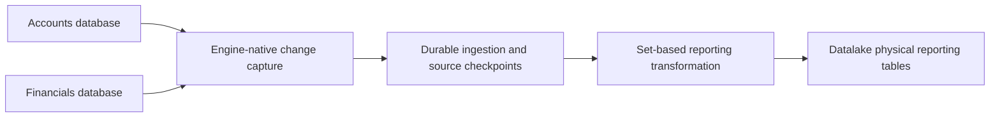

# Physical reporting synchronization

The existing consumer views read Accounts-owned rows without copying them. Datalake is a separate, physical reporting database: it keeps a current-state copy of selected source tables and a reporting projection with relationships suited to queries. Source databases and Datalake share one engine instance. SQL Server and PostgreSQL are separate homogeneous demonstrations, not a cross-engine migration.

The examples use Accounts and Financials data. PostgreSQL has equivalent synthetic source tables; the four existing SQL Server APIs are not ported. The reporting projection joins Operations to Accounts. An operation whose account is missing remains visible with missing account details; copying data must not silently remove a Financials-owned operation. Existing AccountHistory rows are copied as source data. The synchronizer does not create additional business history.

## Capture and application



Capture and publication are distinct boundaries. A completed source transaction must be durably recorded before its capture position is acknowledged. A reporting batch must commit before its publication progress advances. Retry can repeat work, but must not duplicate its effects. Changes to joined Accounts rows invalidate the affected operation projections even when those operations have not changed.

The freshness objective is 30 seconds to five minutes from a source commit to a query observing the corresponding reporting state. A polling interval alone does not prove that objective: source capture lag, staging, projection work and backlog all contribute. Transactions committed separately in different source databases do not become one atomic business transaction in Datalake. Reporting reads across several queries also require an appropriate transaction if they need a stable snapshot.

## SQL Server

Change Tracking records changed keys and deletion operations. The worker obtains the current row values under snapshot isolation. Each source database has its own change version; versions from different databases are not comparable. Initial rows and their synchronization version must use a consistent source snapshot. Before incremental extraction, validate the saved version against the source retention window.

Same-instance `INSERT ... SELECT` moves source rows into staging without sending them through a client bulk-copy round trip. A complete coherent extraction window can be larger than a publication batch: a row limit must never discard the tail of a Change Tracking result while advancing its version. Durable staging and continuation allow bounded application. Snapshot extraction still consumes source resources and version-store space; initial loading and very large backlogs need separate measurement.

Change Tracking does not preserve intermediate changes. This is appropriate for the current-state copy; the existing historical tables are copied normally. If a future requirement needs every modification, reassess CDC rather than infer that polling retained it. Expired versions, source restore or incompatible source schema changes require explicit recovery; they must not be silently treated as an empty batch.

## PostgreSQL

Each source database has a publication and a `pgoutput` logical replication slot. The initial exported snapshot and the subsequent change stream must share a boundary so that writes during initial loading are not lost. Npgsql receives committed source transactions; binary `COPY` loads rows into target ingestion efficiently. Replica identity is required for updates and deletes.

The consumer routes data to source-specific target tables. This avoids the native subscription restriction that source and target tables must have the same schema-qualified name, which can collide when several source databases contain `public.accounts`. Target schema changes remain explicit: PostgreSQL logical replication does not replicate DDL. Startup validates mirror and reporting columns, types, numeric precision, nullability and primary keys; incompatible drift stops synchronization before publishing or acknowledging changes.

Slots retain WAL while consumption is stopped. Monitor retained WAL and source-to-target lag, and distinguish a recoverable backlog from an invalidated or missing slot that needs an explicit resnapshot. Acknowledging data before the target commit can lose changes after a crash. Losing an acknowledgment after the commit can replay changes, so the target checkpoint must make replay harmless.

The PostgreSQL demonstration applies one committed source transaction per COPY batch. It does not combine separate source commits into a time-based buffer. A source transaction that exceeds a configured row or byte limit is refused atomically, without advancing its checkpoint; increase the budget explicitly or change the producer transaction size before retrying. Separate projection row and conservative output-byte budgets bound dependent recomputation. They do not bound all SQL work: a single operation can still have many historical transactions to aggregate. Initial loading streams rows but uses one target transaction per source snapshot. Snapshot duration, target WAL and rollback cost need separate measurement.

The normal PostgreSQL worker emits a transactional logical heartbeat at its configured cadence. This lets idle source slots advance when unrelated databases on the same instance generate WAL. It writes capture metadata to the source WAL, not business rows, and requires permission to execute the native logical-message function.

## Commands and parameters

Build the solution with `dotnet build VWP.sln --configuration Release`. Use the console project matching the engine:

```sh
dotnet run --no-build --configuration Release --project src/Datalake/Vwp.Datalake.SqlServer -- --help
dotnet run --no-build --configuration Release --project src/Datalake/Vwp.Datalake.Postgres -- --help
```

Set connection strings through `VWP_SQLSERVER_CONNECTION` or `VWP_POSTGRES_CONNECTION`, outside Git. The bootstrap command creates absent synthetic source databases/tables and target objects, and enables source capture; it is an explicit setup operation requiring elevated permissions. It is not part of ordinary synchronization. Do not run it against an unreviewed production source. SQL Server initializes through `sync`; PostgreSQL requires `snapshot` before `sync`. Both engines expose `observe`. Explicit resnapshot is recovery that replaces the owned current-state mirrors; it is not an archival restore.

| Setting | SQL Server | PostgreSQL |
| --- | --- | --- |
| Database names | `VWP_SQLSERVER_ACCOUNTS_DATABASE`, `VWP_SQLSERVER_FINANCIALS_DATABASE`, `VWP_SQLSERVER_DATALAKE_DATABASE` | Corresponding `VWP_POSTGRES_*_DATABASE` keys |
| Batch rows/bytes | `VWP_ETL_MAX_ROWS`, `VWP_ETL_MAX_BYTES` | Same keys; limit one source transaction |
| Cadence | `VWP_ETL_POLL_SECONDS` for `sync --loop` | `VWP_ETL_POLL_MS` for logical heartbeat/monitoring; committed changes are applied as received |
| Extraction safety | `VWP_ETL_MAX_WINDOW_ROWS`, `VWP_ETL_MAX_WINDOW_BYTES` for coherent staging windows | `VWP_ETL_MAX_PROJECTION_ROWS`, `VWP_ETL_MAX_PROJECTION_BYTES`, `VWP_ETL_MAX_SLOT_LAG_BYTES` |
| Capture retention | `VWP_ETL_CT_RETENTION_DAYS` | Engine WAL retention plus configured slot-lag budget; neither is business-data retention |
| Stored-data horizon | `VWP_ETL_RETENTION_YEARS`, minimum five, no purge | Same key and policy |
| Slot ownership | Not applicable | `VWP_POSTGRES_SLOT_PREFIX`; choose a unique prefix for each pipeline |

SQL Server window safety limits and batch limits are different. A backlog exceeding the staging window budget stops before advancing capture progress; recovery may require an explicitly increased budget or resnapshot. Byte budgets are implementation estimates of staged payload and projection size, not exact process-memory, wire or database-storage limits. SQL Server reports window progress and application duration; those fields are not source-commit latency. The benchmark measures commit completion to observed report visibility separately.

## Configuration and storage

Batch row and byte limits, cadence, source/database names, capture retention or WAL limits, workload sizes and report retention are configurable. The implementation must validate database identifiers separately from data parameters and never print connection strings or credentials. Bootstrap needs elevated source setup permissions; ordinary synchronization should use only the permissions its capture and target writes require.

The current worst-case reference is two million vehicles at 2.5 business transactions per vehicle per day: five million transactions per day, approximately 58 per second on average. A business transaction may change several rows. These are sizing inputs, not observed throughput and not a typical workload assertion. Synthetic runs can configure higher burst rates without implying a new production capacity requirement.

Retain at least five years of transactional data, with a configurable longer horizon. At the reference rate sustained for five 365-day years, the theoretical total is 9.125 billion business transactions before row fanout. The local PoC does not generate or validate that complete volume. Capture-log retention, reporting freshness and stored business-data retention are different settings.

No data is automatically purged when the configured horizon is reached. Source deletes are nevertheless propagated because the current-state mirror is not an archive of records removed from the source. Time-based partitioning and query-specific indexes should be evaluated against real transaction timestamps, row widths and report filters before a production design is selected. The existing Operation model has no business timestamp, so ingestion time must not be presented as transaction time merely to introduce partitions. Five-year production storage, backup and recovery feasibility require separate representative measurements.

Sharing an instance provides native transfer paths but does not isolate reporting CPU, memory or I/O from transactional workloads. The worker must operate within a measured source resource budget. See [verification and workload reproduction](datalake-verification.md) for the disposable runtime, correctness scenarios and bounded local measurements.

## Primary references

- [Microsoft Change Tracking synchronization](https://learn.microsoft.com/en-us/sql/relational-databases/track-changes/work-with-change-tracking-sql-server)
- [Microsoft Change Tracking and CDC comparison](https://learn.microsoft.com/en-us/sql/relational-databases/track-changes/track-data-changes-sql-server)
- [PostgreSQL logical decoding and exported snapshots](https://www.postgresql.org/docs/current/logicaldecoding-explanation.html)
- [PostgreSQL logical replication restrictions](https://www.postgresql.org/docs/current/logical-replication-restrictions.html)
- [Npgsql logical replication](https://www.npgsql.org/doc/replication.html)
- [Npgsql binary COPY](https://www.npgsql.org/doc/copy.html)
